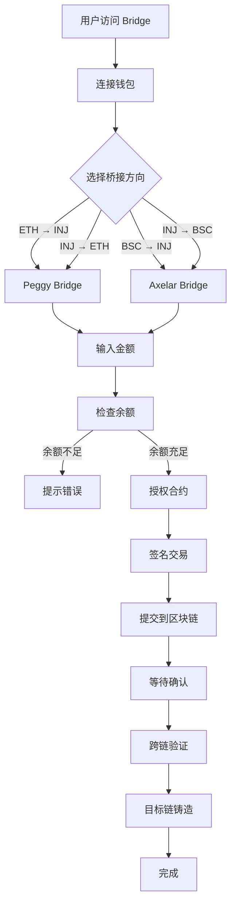

# 01 - 跨链桥业务概述

> **适合人群**: 产品经理、业务人员、新手开发者  
> **阅读时间**: 15 分钟

---

## 📖 目录

1. [什么是跨链桥](#什么是跨链桥)
2. [为什么需要跨链桥](#为什么需要跨链桥)
3. [业务场景](#业务场景)
4. [核心流程](#核心流程)
5. [支持的资产](#支持的资产)
6. [费用说明](#费用说明)
7. [风险提示](#风险提示)

---

## 🌉 什么是跨链桥

### 基本概念

**跨链桥（Cross-Chain Bridge）** 是连接不同区块链网络的基础设施，允许用户在不同链之间转移加密资产。

### 生活类比

#### 🏦 像国际银行转账
```
你在中国有 1000 元人民币
想在美国使用
↓
通过银行（跨链桥）转账
↓
在美国账户收到对应的美元
```

#### 🚢 像货物运输
```
货物在 A 港口（以太坊）
需要运到 B 港口（Injective）
↓
通过货船（跨链桥）运输
↓
货物安全到达 B 港口
```

### 技术原理

```
┌─────────────┐           ┌─────────────┐           ┌─────────────┐
│  以太坊     │           │  跨链桥     │           │  Injective  │
│             │           │             │           │             │
│  100 USDT   │  ──────>  │  锁定/验证  │  ──────>  │  100 USDT   │
│  (ERC20)    │           │             │           │  (原生代币) │
└─────────────┘           └─────────────┘           └─────────────┘
     锁定                     中间处理                   铸造
```

**关键步骤**：
1. **锁定**：在源链（以太坊）锁定你的资产
2. **验证**：跨链桥验证交易有效性
3. **铸造**：在目标链（Injective）铸造等量代币
4. **释放**：用户可以在目标链使用代币

---

## 🤔 为什么需要跨链桥

### 1. **区块链是孤岛**

```
以太坊            Injective         BNB Chain
   🏝️                🏝️                🏝️
  孤立的            孤立的            孤立的
  无法直接交互      无法直接交互      无法直接交互
```

**问题**：
- 你在以太坊的 USDT 不能在 Injective 上使用
- 每条链都有自己的代币标准
- 无法跨链转账

### 2. **用户需求多样化**

#### 场景 1：降低交易成本
```
以太坊 Gas 费：$50
Injective Gas 费：$0.01
→ 用户想把资产转到 Injective 交易
```

#### 场景 2：访问不同的 DeFi 协议
```
用户在以太坊有 USDT
想参与 Injective 上的 DeFi 项目
→ 需要把 USDT 桥接过来
```

#### 场景 3：套利机会
```
ETH 在以太坊：$3000
ETH 在 Injective：$3020
→ 套利者需要跨链转移资产
```

### 3. **生态互联互通**

```
        跨链桥
          ↓
┌─────────┴─────────┐
│                   │
以太坊  →  Injective  →  BNB Chain
│         ↗  ↓  ↘        │
Polygon  ←───┴───→  Avalanche
```

**价值**：
- 增加流动性
- 扩大用户群
- 丰富应用场景

---

## 💼 业务场景

### 场景 1：充值到 Injective DEX

**用户故事**：
> 小明在 MetaMask 有 1000 USDT，想在 Injective DEX 上交易。

**操作流程**：
1. 访问 Biya Helix Bridge
2. 连接 MetaMask（以太坊钱包）
3. 连接 Keplr（Injective 钱包）
4. 选择：
   - From: Ethereum
   - To: Injective
   - Token: USDT
   - Amount: 1000
5. 点击 "Bridge to Injective"
6. 等待 5-15 分钟
7. 在 Injective 钱包看到 1000 USDT

### 场景 2：从 Injective 提现到以太坊

**用户故事**：
> 小红在 Injective 赚了 500 USDT，想提现到以太坊。

**操作流程**：
1. 访问 Biya Helix Bridge
2. 连接 Keplr（Injective 钱包）
3. 连接 MetaMask（以太坊钱包）
4. 选择：
   - From: Injective
   - To: Ethereum
   - Token: USDT
   - Amount: 500
5. 点击 "Bridge to Ethereum"
6. 等待 5-15 分钟
7. 在 MetaMask 看到 500 USDT

### 场景 3：多链资产管理

**用户故事**：
> 投资者在多个链上有资产，想统一管理。

**优势**：
- 灵活调配资金
- 降低整体成本
- 把握跨链套利机会

---

## 🔄 核心流程

### 流程图



### 详细步骤

#### 1️⃣ **准备阶段**

| 步骤 | 说明 | 时间 |
|------|------|------|
| 连接源链钱包 | MetaMask/OKX（以太坊/BSC） | 5秒 |
| 连接目标链钱包 | Keplr（Injective） | 5秒 |
| 选择代币 | USDT、INJ、WETH 等 | 3秒 |
| 输入金额 | 检查余额 | 5秒 |

#### 2️⃣ **授权阶段**（首次使用）

| 步骤 | 说明 | Gas 费 |
|------|------|--------|
| Approve 合约 | 授权跨链桥使用你的代币 | ~$5-20 |
| 签名确认 | 在钱包中确认 | 免费 |

**注意**：只需授权一次，后续使用无需重复授权。

#### 3️⃣ **桥接阶段**

| 步骤 | 说明 | 时间 | Gas 费 |
|------|------|------|--------|
| 调用桥接合约 | 锁定源链代币 | 1-3 分钟 | $10-50 |
| 跨链验证 | 验证器确认交易 | 3-10 分钟 | 免费 |
| 目标链铸造 | 在目标链铸造代币 | 1-3 分钟 | 免费 |

#### 4️⃣ **完成阶段**

| 步骤 | 说明 |
|------|------|
| 交易确认 | 显示成功提示 |
| 余额更新 | 目标链余额增加 |
| 交易记录 | 可在区块浏览器查看 |

---

## 💰 支持的资产

### Peggy Bridge（以太坊 ↔️ Injective）

| 代币 | 符号 | 类型 | 精度 |
|------|------|------|------|
| Tether | USDT | ERC20 | 6 |
| Injective | INJ | ERC20 | 18 |
| Wrapped Ethereum | WETH | ERC20 | 18 |

### Axelar Bridge（多链 ↔️ Injective）

| 代币 | 符号 | 支持链 | 类型 |
|------|------|--------|------|
| Axelar USDC | axlUSDC | BSC, Polygon, Avalanche | IBC |
| USDT | USDT | BSC | BEP20 |

### 代币映射关系

```
以太坊 USDT (0xdAC1...ec7)
    ↓ Peggy Bridge
Injective USDT (peggy0xdAC1...ec7)

BSC USDT (0x55d3...955)
    ↓ Axelar Bridge
Injective axlUSDC (ibc/7E1A...C0)
```

---

## 💵 费用说明

### 1. **Gas 费**（区块链网络费用）

#### 以太坊 → Injective
```
授权（首次）：$5 - $20
桥接：      $10 - $50
总计：      $15 - $70
```

#### Injective → 以太坊
```
桥接：      $0.01（Injective 端）+ $10-$50（以太坊确认）
总计：      $10 - $50
```

#### BSC → Injective
```
授权（首次）：$0.1 - $0.5
桥接：      $1 - $5
总计：      $1 - $6
```

### 2. **桥接费**（协议费用）

| 协议 | 费用 | 说明 |
|------|------|------|
| Peggy Bridge | **免费** | 无协议费 |
| Axelar Bridge | **0.1% - 0.3%** | 根据资产类型 |

### 3. **费用优化建议**

✅ **推荐做法**：
- 在 Gas 费低谷时段桥接（北京时间早上 6-10 点）
- 一次性转移大额，摊薄成本
- 优先使用 BSC（Gas 费更低）

❌ **不推荐**：
- 频繁小额转账
- Gas 费高峰期操作
- 使用以太坊 Layer 1（除非必要）

---

## ⚠️ 风险提示

### 1. **技术风险**

| 风险 | 说明 | 概率 | 缓解措施 |
|------|------|------|----------|
| 智能合约漏洞 | 合约被攻击 | 极低 | 使用经过审计的官方合约 |
| 网络拥堵 | 交易延迟 | 中 | 耐心等待，不要重复发送 |
| 交易失败 | Gas 费不足等 | 低 | 检查余额，设置合理 Gas |

### 2. **操作风险**

❌ **常见错误**：
- 填写错误的接收地址
- 金额输入错误（多一个零）
- 网络选择错误
- 余额不足支付 Gas 费

✅ **最佳实践**：
- **小额测试**：首次使用先转少量代币
- **仔细检查**：转账前核对所有信息
- **保存记录**：记录交易哈希
- **充足余额**：保证有足够的 Gas 费

### 3. **时间风险**

| 情况 | 时间范围 | 建议 |
|------|----------|------|
| 正常情况 | 5-15 分钟 | 耐心等待 |
| 网络拥堵 | 30-60 分钟 | 检查区块浏览器 |
| 异常情况 | >2 小时 | 联系技术支持 |

### 4. **资金风险**

⚠️ **重要提醒**：
- 跨链桥不可逆：转错了无法撤回
- 最小金额限制：太小的金额可能不划算
- 最大金额限制：单次转账可能有上限
- 滑点：极端情况下可能有价格差异

---

## 🎯 小结

### 关键要点

1. **跨链桥是什么**
   - 连接不同区块链的桥梁
   - 允许资产在链之间转移

2. **为什么需要**
   - 区块链天然孤立
   - 用户需要跨链操作
   - 提高资金效率

3. **如何使用**
   - 连接钱包 → 选择路径 → 输入金额 → 确认交易
   - 等待 5-15 分钟完成

4. **注意事项**
   - 检查 Gas 费
   - 小额测试
   - 保存交易记录

---

## 📖 下一步

- 👉 [核心概念](./03-核心概念.md) - 理解 Peggy、Axelar 等技术术语
- 👉 [架构设计](./02-架构设计.md) - 了解技术实现
- 👉 [常见问题](./07-常见问题.md) - 解决使用中的疑问

---

*最后更新: 2025-10-30*

