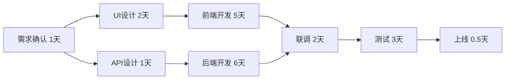

# 从开发者到项目管理者转型指南

## 目录
- [角色转变认知](#角色转变认知)
- [核心能力矩阵](#核心能力矩阵)
- [工时评估方法](#工时评估方法)
- [任务拆解评估](#任务拆解评估)
- [风险管理](#风险管理)
- [团队协作](#团队协作)
- [实战案例](#实战案例)
- [常用工具与模板](#常用工具与模板)

---

## 角色转变认知

### 从"做事"到"管事"的思维转变

| 开发者思维 | 项目管理者思维 |
|----------|--------------|
| 关注技术实现 | 关注业务价值和交付 |
| 追求完美代码 | 平衡质量、时间、成本 |
| 个人效率最大化 | 团队效率最大化 |
| 深度思考问题 | 广度把控全局 |
| 完成分配的任务 | 确保目标达成 |

### 关键转变点

1. **视角转变**：从技术细节到业务全局
2. **沟通对象**：从代码到人（团队、客户、管理层）
3. **成功标准**：从代码质量到项目成功交付
4. **时间分配**：从80%编码到80%沟通协调
5. **责任边界**：从个人产出到团队产出

---

## 核心能力矩阵

### 必备技能清单

```
┌─────────────────────────────────────────────┐
│ 技术背景（已具备） ✓                          │
│ ├─ 理解技术实现难度                           │
│ ├─ 识别技术风险                               │
│ └─ 与开发团队有效沟通                         │
└─────────────────────────────────────────────┘
                    ↓
┌─────────────────────────────────────────────┐
│ 项目管理技能（需培养）                         │
│ ├─ 工时评估与预算控制                         │
│ ├─ 任务拆解与依赖管理                         │
│ ├─ 风险识别与应对                            │
│ ├─ 进度跟踪与汇报                            │
│ └─ 资源协调与冲突解决                         │
└─────────────────────────────────────────────┘
                    ↓
┌─────────────────────────────────────────────┐
│ 软技能（持续精进）                            │
│ ├─ 跨部门沟通协调                            │
│ ├─ 向上管理（汇报与争取资源）                  │
│ ├─ 向下管理（激励与辅导）                      │
│ ├─ 决策能力（在不确定中做决定）                │
│ └─ 问题解决（系统性思考）                      │
└─────────────────────────────────────────────┘
```

---

## 工时评估方法

### 1. 三点估算法（PERT）

最适合软件项目的估算方法：

```
期望工时 = (乐观值 + 4×最可能值 + 悲观值) / 6
```

**实例：开发一个用户登录功能**

```
乐观值：2天（一切顺利，API文档齐全，无需调试）
最可能值：5天（常规开发，有一些问题需要解决）
悲观值：10天（需求变更，API不稳定，大量调试）

期望工时 = (2 + 4×5 + 10) / 6 = 5.3天 ≈ 6天
```

### 2. 故事点估算法（敏捷）

使用斐波那契数列：1, 2, 3, 5, 8, 13, 21

| 故事点 | 复杂度 | 参考工时 | 示例 |
|-------|-------|---------|-----|
| 1 | 极简单 | 0.5天 | 修改文案、调整样式 |
| 2 | 简单 | 1天 | 新增简单表单字段 |
| 3 | 中等 | 2-3天 | 实现基础CRUD功能 |
| 5 | 较复杂 | 4-5天 | 用户认证系统 |
| 8 | 复杂 | 1周 | 支付集成 |
| 13 | 很复杂 | 2周 | 实时通信系统 |
| 21 | 史诗级 | >2周 | 需要拆分 |

**原则：超过13点的任务必须拆分！**

### 3. 历史数据对比法

建立项目数据库：

```markdown
## 功能开发历史记录

| 功能类型 | 描述 | 预估工时 | 实际工时 | 偏差率 | 备注 |
|---------|-----|---------|---------|-------|------|
| 用户登录 | 前后端+测试 | 5天 | 7天 | +40% | 第三方登录接口不稳定 |
| 列表页面 | 含筛选排序 | 3天 | 2.5天 | -17% | 组件复用良好 |
| 表单提交 | 多步骤表单 | 8天 | 10天 | +25% | 需求中途调整 |
```

**计算偏差系数**：
```
平均偏差系数 = Σ(实际工时/预估工时) / 项目数
例如：(1.4 + 0.83 + 1.25) / 3 = 1.16

新项目预估 = 初步预估 × 偏差系数
```

### 4. 工时分解结构（自底向上）

将功能拆解到**最小可评估单元**（2小时-1天）：

```
【示例】电商购物车功能

购物车功能 (总计)
├─ 前端开发 (15天)
│   ├─ 购物车列表组件 (3天)
│   │   ├─ UI布局 (0.5天)
│   │   ├─ 商品信息展示 (0.5天)
│   │   ├─ 数量增减交互 (1天)
│   │   └─ 删除/批量操作 (1天)
│   ├─ 金额计算展示 (2天)
│   ├─ 优惠券选择 (3天)
│   ├─ 结算流程 (5天)
│   └─ 响应式适配 (2天)
├─ 后端开发 (12天)
│   ├─ 数据模型设计 (1天)
│   ├─ API开发 (6天)
│   ├─ 库存锁定逻辑 (3天)
│   └─ 并发控制 (2天)
└─ 测试与联调 (5天)
    ├─ 单元测试 (2天)
    ├─ 集成测试 (2天)
    └─ 性能测试 (1天)

总工时：32天（单人） → 需要3人并行：约15个工作日
```

### 5. 缓冲时间设置

**帕金森定律警示**：工作会自动填满可用时间

```
合理的缓冲设置：

核心开发工时：60%
测试联调：15%
需求变更：10%
技术风险：10%
会议沟通：5%
─────────────
总计：100%
```

**实际操作建议**：
- 对外承诺：预估工时 × 1.5
- 内部计划：预估工时 × 1.3
- 个人目标：预估工时 × 1.0

---

## 任务拆解评估

### SMART原则拆解法

每个任务必须符合：

- **S**pecific（具体的）：明确要做什么
- **M**easurable（可衡量的）：有清晰的完成标准
- **A**chievable（可实现的）：在资源和能力范围内
- **R**elevant（相关的）：与项目目标直接相关
- **T**ime-bound（有时限的）：有明确的截止日期

### 任务拆解的黄金规则

```
1. 颗粒度原则：单个任务 0.5-3 天
   - 太小：管理成本过高
   - 太大：风险难以控制

2. 独立性原则：任务间依赖尽量少
   - 可以并行开发
   - 降低阻塞风险

3. 可验证原则：每个任务有明确的"完成定义"
   - Done = Coded + Tested + Reviewed + Merged

4. 均衡分配原则：考虑团队成员能力
   - 核心成员：复杂任务
   - 新成员：简单任务 + 辅导
```

### WBS（工作分解结构）模板

```
项目：Biya Coin 钱包功能

Level 1: 功能模块
├─ Level 2: 子功能
│   ├─ Level 3: 开发任务
│   │   └─ Level 4: 具体工作项

【示例展开】

1. 钱包资产管理
   1.1 资产总览页面
       1.1.1 前端开发
           ├─ 资产列表组件 (2天) [@张三]
           ├─ 图表展示组件 (1.5天) [@李四]
           └─ 刷新与加载逻辑 (1天) [@张三]
       1.1.2 API对接
           ├─ 资产查询接口 (1天) [@王五]
           └─ 价格推送接口 (2天) [@王五]
       1.1.3 测试
           ├─ 单元测试 (1天) [@张三]
           └─ E2E测试 (1天) [@测试组]
   
   1.2 交易记录查询
       1.2.1 前端开发 (5天)
       1.2.2 后端开发 (4天)
       1.2.3 测试 (2天)

2. 转账功能
   2.1 ...
```

### 依赖关系识别

**关键路径法（CPM）**：



**关键路径**：A → C → E → F → G → H = 13.5天
（如果E延期1天，项目就延期1天）

**并行路径**：A → B → D → F = 10天
（D即使延期2天，也不影响总工期）

### 风险评估矩阵

对每个任务进行风险评分：

| 任务 | 技术难度 | 依赖复杂度 | 资源可用性 | 风险等级 | 应对策略 |
|-----|---------|-----------|-----------|---------|---------|
| 用户认证 | 中 | 高 | 高 | 🟡中 | 提前对接第三方API |
| 支付对接 | 高 | 高 | 中 | 🔴高 | 安排最资深工程师+增加测试时间 |
| 列表页面 | 低 | 低 | 高 | 🟢低 | 常规开发 |

**风险等级计算**：
```
风险分数 = 技术难度(1-5) × 依赖复杂度(1-5) × (1 - 资源可用性(0-1))

0-5分：🟢低风险
6-10分：🟡中风险
11+分：🔴高风险
```

### 任务优先级排序

**MoSCoW方法**：

- **M**ust have（必须有）：核心功能，MVP必需
- **S**hould have（应该有）：重要但不紧急
- **C**ould have（可以有）：锦上添花
- **W**on't have（不会有）：明确排除

**价值-成本矩阵**：

```
高价值/低成本 │ 高价值/高成本
   (优先做)   │   (重点投入)
──────────────┼──────────────
低价值/低成本 │ 低价值/高成本
   (有空做)   │   (不要做)
```

---

## 风险管理

### 常见技术风险清单

```markdown
## 风险登记表

| 风险ID | 风险描述 | 概率 | 影响 | 风险等级 | 应对措施 | 责任人 |
|-------|---------|------|------|---------|---------|-------|
| R001 | 第三方API不稳定 | 70% | 高 | 🔴 | 提前集成测试，准备Mock方案 | 后端负责人 |
| R002 | 核心开发请假 | 30% | 高 | 🟡 | 交叉培训，知识文档化 | PM |
| R003 | 需求频繁变更 | 80% | 中 | 🟡 | 需求冻结机制，变更评审流程 | PM+产品 |
| R004 | 性能不达标 | 40% | 高 | 🟡 | 提前性能测试，设置监控阈值 | 技术负责人 |
| R005 | 跨团队依赖延期 | 50% | 中 | 🟡 | 每周同步会议，提前预警 | PM |
```

### 应对策略4T原则

1. **Transfer（转移）**：外包、购买保险、分包
2. **Tolerate（容忍）**：接受风险，准备应急预算
3. **Treat（处理）**：采取措施降低概率或影响
4. **Terminate（终止）**：改变方案，避开风险

---

## 团队协作

### 每日站会（Daily Standup）

**时间**：15分钟，固定时间
**格式**：每人回答3个问题

```
1. 昨天完成了什么？
2. 今天计划做什么？
3. 遇到什么阻碍？
```

**PM的职责**：
- 记录阻碍并跟进解决
- 发现风险及时预警
- 不在会上讨论技术细节（会后单独沟通）

### 周报模板

```markdown
# 项目周报 - Biya Coin（第X周）

## 📊 整体进度
- 计划进度：60%
- 实际进度：55%
- 状态：🟡 轻微延期

## ✅ 本周完成
1. 钱包资产展示页面开发完成（张三）
2. 交易记录API联调完成（李四、王五）
3. 用户体系安全评审通过（团队）

## 🚧 下周计划
1. 转账功能前后端开发（张三、王五）
2. 支付对接集成测试（李四）
3. 性能优化（全员）

## ⚠️ 风险与问题
1. 🔴 【高风险】第三方支付接口文档不完整
   - 影响：可能延期3天
   - 应对：已联系对方技术支持，周三前必须解决

2. 🟡 【中风险】张三下周请假2天
   - 影响：转账功能可能延期
   - 应对：李四提前熟悉代码，准备接手

## 📈 数据指标
- 代码提交：87次
- Bug修复：12个
- 测试覆盖率：78%（目标80%）
```

### 激励与反馈

**反馈的STAR模型**：

```
Situation（情境）：在什么情况下
Task（任务）：需要完成什么
Action（行动）：采取了什么行动
Result（结果）：产生了什么结果

正面反馈示例：
"上周（S）在支付接口对接遇到问题时（T），你主动找到对方技术团队
深夜会议沟通（A），最终提前1天完成集成（R）。这种主动解决问题
的态度非常棒！"

改进反馈示例：
"在昨天的需求评审会上（S），客户对交互细节有疑问（T），我注意到
你直接说'这个很难实现'（A），导致客户不满（R）。下次遇到这种情况，
可以先询问客户的具体需求，再评估技术方案，这样沟通会更顺畅。"
```

---

## 实战案例

### 案例：一个真实的项目延期复盘

**项目背景**：开发一个区块链钱包App，计划2个月上线

#### 初始计划（失败的）

```
功能模块：10个
总工时预估：40人天
团队：2个前端 + 1个后端 + 1个测试
计划工期：40天

错误点：
❌ 没有考虑沟通成本
❌ 没有预留缓冲时间
❌ 任务颗粒度太大（每个5-8天）
❌ 忽略了依赖关系
```

#### 实际情况

```
Week 1-2: 需求反复变更，设计稿延期
Week 3-4: 区块链节点不稳定，后端重构
Week 5: 前端A病假1周
Week 6-7: 发现安全漏洞，紧急修复
Week 8: 测试发现重大Bug
Week 9-10: 修复与回归测试

实际工期：70天（延期75%）
```

#### 改进后的计划（成功的）

```
1. 任务细化到1-2天粒度
2. 使用三点估算法重新评估：
   - 核心开发：60人天
   - 测试联调：20人天
   - 缓冲时间：20人天
   - 总计：100人天

3. 关键路径识别：
   - 区块链节点对接是关键路径
   - 提前2周开始技术预研

4. 风险预案：
   - 备份人员计划
   - 每周风险评审
   - 阶段性交付，降低返工成本

5. 实际交付：55天完成（提前5天）
```

---

## 常用工具与模板

### 工具推荐

**项目管理工具**：
- **Jira**：适合敏捷开发
- **Trello**：轻量级看板
- **Notion**：文档+任务一体化
- **禅道**：国产，功能全面

**时间追踪**：
- **Toggl**：个人工时统计
- **Clockify**：团队工时管理

**甘特图**：
- **Microsoft Project**：专业级
- **GanttProject**：开源免费
- **飞书/钉钉文档**：在线协作

### 模板下载

#### 1. 任务拆解模板（CSV格式）

```csv
任务ID,任务名称,负责人,优先级,预估工时(天),开始日期,截止日期,依赖任务,状态,备注
TSK-001,需求文档评审,张三,P0,0.5,2025-11-08,2025-11-08,,已完成,
TSK-002,数据库设计,王五,P0,2,2025-11-08,2025-11-11,TSK-001,进行中,
TSK-003,API接口设计,王五,P0,1,2025-11-11,2025-11-12,TSK-002,待开始,
TSK-004,前端页面开发,李四,P0,5,2025-11-11,2025-11-18,TSK-001,待开始,可与后端并行
TSK-005,API开发,王五,P0,6,2025-11-12,2025-11-20,TSK-003,待开始,
TSK-006,前后端联调,李四+王五,P0,2,2025-11-20,2025-11-22,TSK-004+TSK-005,待开始,
```

#### 2. 工时评估表

```markdown
## 功能：用户钱包管理

### 三点估算

| 子任务 | 乐观(天) | 最可能(天) | 悲观(天) | 期望工时 | 指派 |
|-------|---------|-----------|---------|---------|------|
| 页面布局 | 0.5 | 1 | 2 | 1.1 | 前端 |
| 数据获取 | 1 | 2 | 4 | 2.2 | 前端 |
| 状态管理 | 1 | 2 | 3 | 2.0 | 前端 |
| API开发 | 2 | 4 | 7 | 4.2 | 后端 |
| 测试 | 1 | 2 | 4 | 2.2 | 测试 |
| **总计** | **5.5** | **11** | **20** | **11.7** | - |

### 缓冲时间
- 核心开发：11.7天
- 变更预留：2天
- 风险预留：2天
- **对外承诺：16天**
```

#### 3. 风险管理清单

```markdown
## 项目风险追踪表

### 🔴 高风险（需立即处理）
- [ ] 第三方API稳定性未验证
  - **应对**：本周完成压测，准备降级方案
  - **责任人**：后端负责人
  - **截止**：11月10日

### 🟡 中风险（持续关注）
- [ ] 团队对新技术栈不熟悉（React Query）
  - **应对**：技术分享+结对编程
  - **责任人**：技术 Leader
  
### 🟢 低风险（常规跟进）
- [ ] UI设计可能微调
  - **应对**：组件化开发，降低修改成本
```

#### 4. 每日进度追踪表

```markdown
# 每日进度看板 - 2025年11月7日

## 🏃 进行中
- [ ] API开发 - 用户登录接口（王五，预计今日完成）
- [ ] 前端页面 - 交易记录列表（李四，完成60%）

## ✅ 今日完成
- [x] 需求评审会议
- [x] 数据库表结构设计

## ⏸️ 阻塞中
- [ ] 支付对接 - 等待第三方开通测试账号（已催促）

## 📅 明日计划
- [ ] 前后端联调 - 登录功能
- [ ] 开始转账功能开发
```

---

## 学习路径建议

### 入门阶段（1-3个月）

```
Week 1-4: 基础理论学习
├─ 阅读《人月神话》
├─ 学习敏捷开发（Scrum）基础
└─ 掌握一个项目管理工具

Week 5-8: 小项目实践
├─ 负责一个2-3人的小功能模块
├─ 练习工时评估和任务拆解
└─ 每周写项目总结

Week 9-12: 反思与改进
├─ 对比预估与实际工时
├─ 总结失误和经验
└─ 建立自己的评估模型
```

### 进阶阶段（3-6个月）

```
- 负责完整的小型项目（1-2个月周期）
- 开始管理3-5人的小团队
- 学习向上汇报和跨部门协调
- 深入学习风险管理和质量控制
```

### 成熟阶段（6个月+）

```
- 负责中大型项目（3个月+周期）
- 管理5人以上团队
- 处理复杂的资源冲突和优先级决策
- 培养其他项目管理者
```

---

## 常见陷阱与避坑指南

### ❌ 陷阱1：过于乐观的估算

**表现**：总觉得"这个简单，1天就能搞定"

**后果**：频繁延期，团队士气低落

**解决**：
- 使用三点估算法，强制考虑悲观情况
- 查看历史数据，用事实说话
- 让开发人员自己评估工时

### ❌ 陷阱2：计划过于细致

**表现**：把2个月的项目拆解成500个任务

**后果**：花大量时间做计划和更新，计划跟不上变化

**解决**：
- 近期详细，远期粗略
- 按迭代滚动规划
- 任务颗粒度保持在1-3天

### ❌ 陷阱3：忽视沟通成本

**表现**：简单计算"3个人做10天的活，1个人就要30天"

**后果**：人越多越慢（人月神话）

**解决**：
- 团队规模超过5人，沟通成本指数增长
- 预留15-25%的时间用于会议和协调
- 尽量减少跨团队依赖

### ❌ 陷阱4：不敢说"不"

**表现**：产品/老板提需求，全部答应

**后果**：范围蔓延，项目失控

**解决**：
- 明确项目目标和范围
- 新需求走变更流程，评估影响
- 用数据说话："加这个功能需要延期5天，你选择？"

### ❌ 陷阱5：微观管理

**表现**：频繁询问进度，干涉技术细节

**后果**：团队反感，效率降低

**解决**：
- 相信团队，聚焦结果而非过程
- 每日站会足够，不要额外打扰
- 只在里程碑节点和风险点深入跟进

---

## 推荐书单

### 必读
1. **《人月神话》** - Fred Brooks（软件工程圣经）
2. **《敏捷革命》** - Jeff Sutherland（Scrum创始人）
3. **《项目管理修炼之道》** - Johanna Rothman（实战指南）

### 进阶
4. **《关键对话》** - 沟通技巧
5. **《高效能人士的七个习惯》** - 自我管理
6. **《凤凰项目》** - DevOps与IT管理（小说形式）

---

## 总结

从开发者到项目管理者，本质上是**从"把事做对"到"做对的事"**的转变。

### 关键要点回顾

```
✅ 工时评估：三点估算法 + 历史数据 + 缓冲时间
✅ 任务拆解：1-3天颗粒度 + SMART原则 + 依赖分析
✅ 风险管理：提前识别 + 量化评估 + 预案准备
✅ 团队协作：清晰沟通 + 及时反馈 + 信任授权
✅ 持续改进：记录数据 + 定期复盘 + 迭代优化
```

### 第一个项目行动清单

- [ ] 创建项目文档（目标、范围、团队）
- [ ] 使用WBS拆解任务到1-3天颗粒度
- [ ] 使用三点估算法评估每个任务
- [ ] 识别关键路径和前3大风险
- [ ] 建立每日站会和周报机制
- [ ] 选择一个项目管理工具开始使用
- [ ] 每周记录预估vs实际数据
- [ ] 项目结束后做复盘并更新你的评估模型

---

**记住**：没有人天生就是好的项目管理者，这是一个需要在实践中不断打磨的技能。

**开始第一个项目，然后不断改进！** 🚀

---

*文档版本：v1.0*  
*最后更新：2025年11月7日*  
*作者：Biya Coin 项目组*

